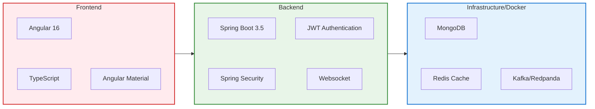
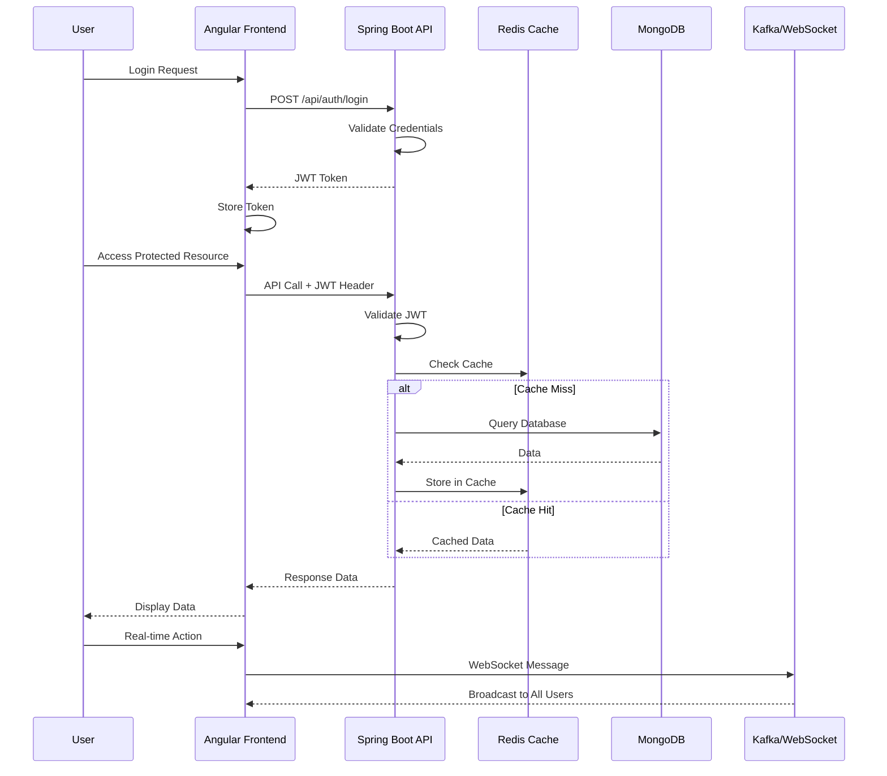

# 🚀 Spring Boot Angular Playground

[](https://angular.io/)
[](https://spring.io/projects/spring-boot)
[](https://openjdk.org/)
[](https://www.typescriptlang.org/)
[](https://www.mongodb.com/)
[](https://redis.io/)
[](https://kafka.apache.org/)

A comprehensive full-stack application demonstrating modern web development practices with **Spring Boot** backend and **Angular** frontend, featuring real-time communication, caching strategies, authentication, and database operations.

## 📋 Table of Contents

- [🏗️ Architecture](#️-architecture)
- [✨ Features](#-features)
- [🛠️ Technologies Used](#️-technologies-used)
- [🚀 Quick Start](#-quick-start)
- [🧪 API Endpoints](#-api-endpoints)

## 🏗️ Architecture

The application follows a modern microservices-inspired architecture with clear separation of concerns:



### System Flow Diagram



## ✨ Features

### 🔐 Authentication & Authorization
- **JWT-based authentication** with Spring Security
- **User registration and login** system
- **Protected routes** with Angular guards
- **Role-based access control** (USER/ADMIN roles)

### 🏠 Home Dashboard
**Placeholder for Home Dashboard Screenshot**
*[Insert screenshot of the main dashboard showing user information and navigation]*

The home dashboard provides:
- Welcome message with user information
- Quick access to all application features
- Responsive navigation menu
- User profile display

### 📊 Cache Analytics & Performance Monitoring
**Placeholder for Cache Analytics Screenshot**
*[Insert screenshot of the cache analytics page showing performance metrics and charts]*

- **Real-time cache performance monitoring**
- **Hit/miss ratio analytics** with auto-refresh
- **Memory usage statistics**
- **Rate limiting demonstrations**
- **Cache warming capabilities**
- **Manual cache eviction tools**

### 🗄️ MongoDB CRUD Operations
**Placeholder for MongoDB Management Screenshot**
*[Insert screenshot of the MongoDB page showing the data table and forms]*

- **Full CRUD operations** on test documents
- **Reactive forms** with validation
- **Data table** with sorting and filtering
- **User-specific document management**
- **Real-time data updates**

### 🌐 Public APIs Integration
**Placeholder for Public APIs Screenshot**
*[Insert screenshot of the public APIs page showing different API responses]*

- **Disney Characters API** integration with caching
- **DigitalOcean Status API** monitoring
- **UK Bank Holidays API** with data transformation
- **Intelligent caching strategies** (30min, 15min, 2hr TTL)
- **Error handling** and retry mechanisms

### 💬 Real-time WebSocket Chat
**Placeholder for WebSocket Chat Screenshot**
*[Insert screenshot of the WebSocket chat interface with messages and online users]*

- **Real-time chat functionality** using STOMP/WebSocket
- **User presence tracking** (online/offline status)
- **Message broadcasting** to all connected users
- **Connection management** with reconnection logic
- **Chat history** and user notifications

## 🛠️ Technologies Used

### Frontend Stack
| Technology | Version | Purpose |
|------------|---------|---------|
| **Angular** | 16.1.0 | Core frontend framework |
| **Angular Material** | 16.1.0 | UI component library |
| **TypeScript** | 5.1.3 | Type-safe JavaScript |
| **RxJS** | 7.8.0 | Reactive programming |
| **NGX Translate** | 16.0.4 | Internationalization |
| **STOMP.js** | 7.1.1 | WebSocket messaging |
| **SockJS** | 1.6.1 | WebSocket fallback |

### Backend Stack
| Technology | Version | Purpose |
|------------|---------|---------|
| **Spring Boot** | 3.5.0 | Core backend framework |
| **Java** | 17 | Programming language |
| **Spring Security** | Latest | Authentication & authorization |
| **Spring Data MongoDB** | Latest | Database integration |
| **Spring WebSocket** | Latest | Real-time communication |
| **Spring Kafka** | Latest | Message streaming |
| **JWT** | 0.11.5 | Token-based authentication |
| **Lombok** | 1.18.38 | Code generation |

### Infrastructure & Databases
| Technology | Version | Purpose |
|------------|---------|---------|
| **MongoDB** | 6.0.12 | Primary database |
| **Redis** | 7.2.4 | Caching & session store |
| **Redpanda** | v24.1.3 | Kafka-compatible streaming |
| **Docker Compose** | Latest | Container orchestration |
| **Maven** | Latest | Build automation |

## 🚀 Quick Start

### Prerequisites
- **Java 17+** installed
- **Node.js 16+** and npm
- **Docker** and **Docker Compose**
- **Git** for cloning

### Installation & Setup

1. **Clone the repository**
   ```bash
   git clone https://github.com/kougianos/spring-boot-angular-playground.git
   cd spring-boot-angular-playground
   ```

2. **Start the application** (automated with script)
   ```bash
   # Make the script executable (Linux/Mac)
   chmod +x start.sh
   
   # Run the complete stack
   ./start.sh
   ```

   **What the start script does:**
   - 🐳 Starts Docker infrastructure (MongoDB, Redis, Redpanda)
   - 📦 Installs Angular dependencies
   - 🏗️ Builds and starts Spring Boot application
   - ⚡ Launches Angular development server
   - 📊 Shows combined logs with color coding

3. **Access the applications**
   - **Frontend**: http://localhost:4200
   - **Backend API**: http://localhost:8080
   - **MongoDB**: localhost:27017
   - **Redis**: localhost:6379
   - **Redpanda**: localhost:9092

### Manual Setup (Alternative)

If you prefer manual setup:

```bash
# Start infrastructure
docker-compose up -d

# Backend setup
cd spring-boot
mvn spring-boot:run

# Frontend setup (new terminal)
cd angular
npm install
npm start
```

### Default Credentials

Register a new account or use these test credentials:
- **Username**: Create your own during registration
- **Password**: Set during registration
- **Admin features**: Available to all registered users

## 🧪 API Endpoints

### Authentication Endpoints
```http
POST /api/auth/login      # User authentication
POST /api/auth/signup     # User registration  
GET  /api/auth/me         # Current user info
```

### MongoDB CRUD Endpoints
```http
GET    /api/test-documents        # Get all documents
POST   /api/test-documents        # Create document
PUT    /api/test-documents/{id}   # Update document
DELETE /api/test-documents/{id}   # Delete document
```

### Public APIs Endpoints
```http
GET /api/public/disney-characters    # Disney characters
GET /api/public/digital-ocean-status # DO status
GET /api/public/bank-holidays        # UK bank holidays
```

### Cache Management Endpoints
```http
GET  /api/cache/analytics          # Cache analytics
GET  /api/cache/stats              # Cache statistics
POST /api/cache/clear              # Clear analytics
POST /api/cache/evict/{key}        # Evict specific key
GET  /api/cache/rate-limit-check   # Rate limit test
POST /api/cache/warm-up            # Manual cache warming
```

### WebSocket Endpoints
```http
GET /api/websocket/connected-users  # Get connected users
GET /api/websocket/connection-info  # Connection information
GET /api/websocket/user/{username}/status # User status
```

## 📁 Project Structure

```
├── angular/                   # Frontend application
│   ├── src/app/
│   │   ├── auth/              # Authentication components
│   │   ├── cache-analytics/   # Cache monitoring
│   │   ├── core/              # Core services & guards
│   │   ├── home/              # Dashboard component
│   │   ├── mongodb/           # Database operations
│   │   ├── public-apis/       # External API integration
│   │   ├── shared/            # Shared components
│   │   └── websocket/         # Real-time chat
│   └── package.json
├── spring-boot/               # Backend application
│   ├── src/main/java/com/springboot/starter/
│   │   ├── controller/        # REST controllers
│   │   ├── service/           # Business logic
│   │   ├── model/             # Data models
│   │   ├── repository/        # Data access
│   │   ├── security/          # Security configuration
│   │   └── config/            # Application configuration
│   └── pom.xml
├── docker-compose.yml        # Infrastructure setup
├── start.sh                  # Automated startup script
└── README.md                 # This file
```

---

<div align="center">

**Built with ❤️ using Spring Boot & Angular**

[⬆ Back to Top](#-spring-boot-angular-playground)

</div>
